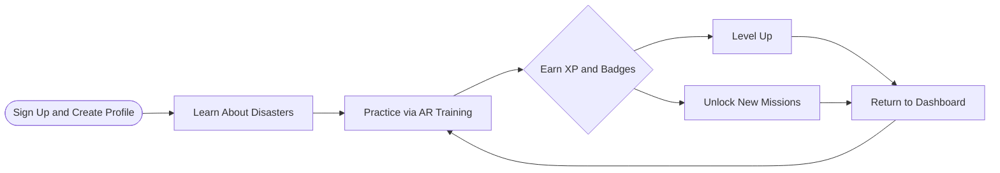
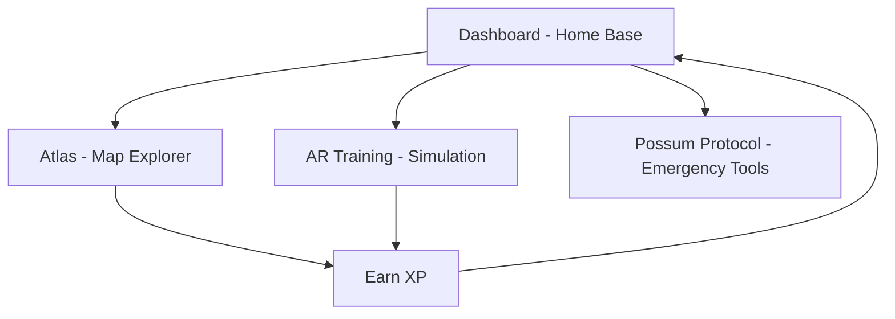
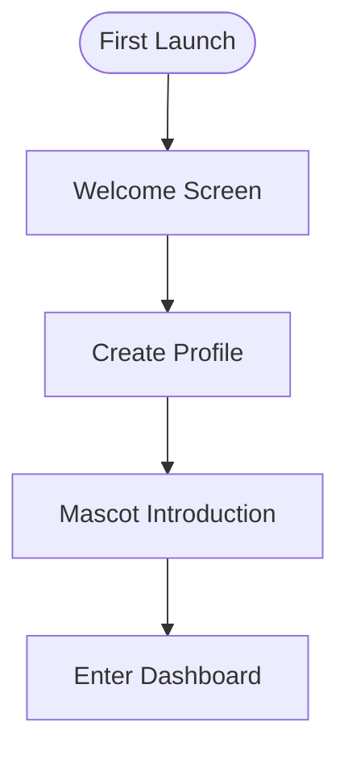
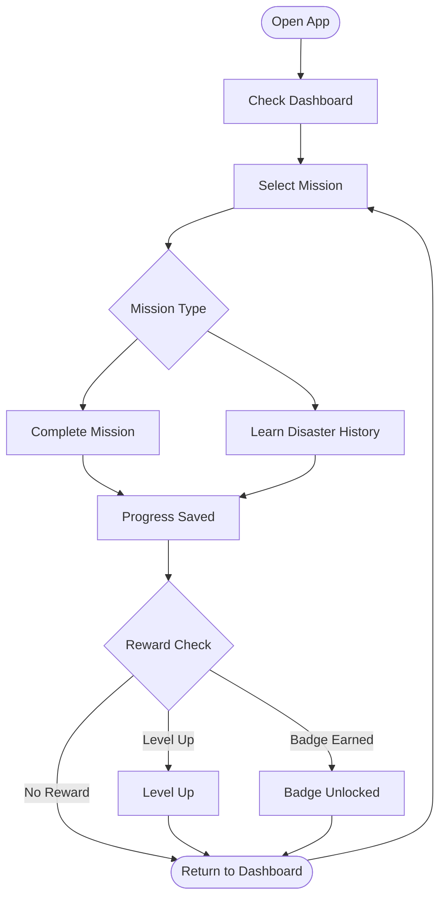
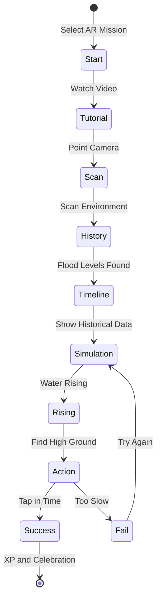
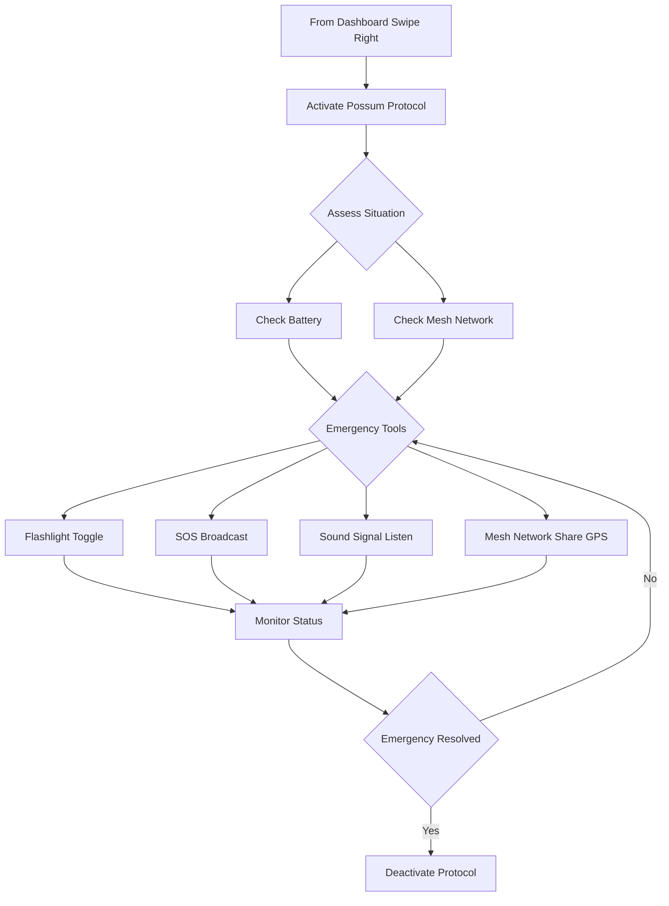
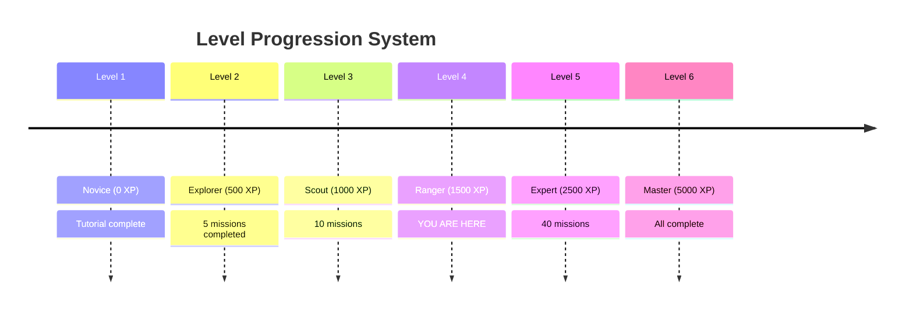
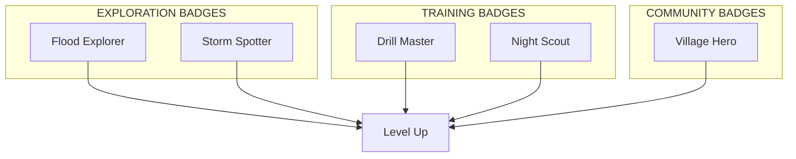
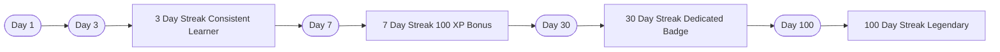

# AI Disaster Resilience Platform

> A gamified, mobile-first AI disaster resilience platform designed for children and communities. The platform combines AI-powered interactive learning, augmented reality (AR), and AI real-time emergency support tools to help users understand disaster risks while also providing practical survival features during real emergencies.

---
## Demo Video
https://www.youtube.com/watch?v=9-Y7TCkZXbg

## Final Report
https://drive.google.com/file/d/1BvBxPdb5UqVc4Zdx0weThzLgVEW48YJn/view?usp=sharing


## What is This Platform?

The AI Disaster Resilience Platform is an **educational web application** that teaches disaster preparedness through **gamified learning experiences**. Designed specifically for the ASEAN region, it combines:

- **Real disaster data** from 10 ASEAN countries
- **Interactive AR-based training** for flood, earthquake, and other disasters
- **Emergency survival tools** that work offline (Possum Protocol)
- **Community-driven safety scores** (Village system)
- **Child-friendly design** with mascots, badges, and rewards

## 🌏 Background
 
Natural disasters — floods, storms, and landslides — occur frequently across ASEAN, with countries like Malaysia experiencing severe seasonal monsoon flooding. These events disproportionately affect vulnerable populations, especially rural communities and school-aged children who often lack the knowledge and tools to respond effectively.
 
Traditional disaster education fails because it is:
 
- 📖 **Lecture-based and forgettable** — passive content doesn't build muscle memory
- 😨 **Not designed for children** — complex language and scary imagery alienate younger audiences
- 📵 **Useless during actual disasters** — existing apps stop working when networks and power go down
- 🧩 **Fragmented** — no single platform combines education, immersive training, and real emergency tools
 
---
 
## 🎯 Problem Statement
 
> Communities in disaster-prone regions, particularly children, often lack accessible and engaging disaster preparedness education as well as reliable emergency communication tools that function during infrastructure failures such as power outages or network disruptions — making it difficult for them to respond safely and effectively during disasters such as floods, earthquakes, and severe storms.
 
---
 
## 🌱 SDG Alignment
 
| SDG | Contribution |
|---|---|
| **SDG 11** — Sustainable Cities & Communities *(Primary)* | Strengthens disaster preparedness and resilience through AI-powered education and emergency response tools |
| **SDG 4** — Quality Education *(Secondary)* | Delivers interactive, gamified digital learning that improves children's disaster safety knowledge |
| **SDG 13** — Climate Action *(Secondary)* | Raises awareness of climate-related disasters and promotes community preparedness across ASEAN |
 
---
 
## 💡 Solution Overview
 
**Project Wira** is a gamified, mobile-first AI disaster resilience platform that transforms passive disaster awareness into active, practised survival readiness. It is the first platform to unify all three pillars of disaster preparedness in a single child-friendly application:
 
```
┌─────────────────────────────────────────────────────────────────┐
│                        PROJECT WIRA                             │
├──────────────┬──────────────┬──────────────┬────────────────────┤
│  DASHBOARD   │    ATLAS     │  AR TRAINING │  POSSUM PROTOCOL   │
│  Home Base   │  Map & Risk  │  Simulation  │  Emergency Tools   │
│  AI Alerts   │  AI Data     │  Training    │  Offline AI Suite  │
│  Missions    │  Explorer    │  Practice    │  Mesh Network      │
└──────────────┴──────────────┴──────────────┴────────────────────┘
```
 
**The core learning loop:**
 
```
LEARN (Atlas)  →  TRAIN (AR Time Machine)  →  EARN (XP & Badges)
     ↑                                               ↓
     └──────────────────── REPEAT ──────────────────┘
                                  ↓
                        SURVIVE (Possum Protocol)
```
 
Unlike traditional platforms, Project Wira provides offline emergency functions — SOS alerts, GPS sharing, flashlight signalling, and AI-powered mesh communication — enabling users to seek help even when internet and power infrastructure fail.
 
---
 
## 🤖 AI Integration
 
AI is not a superficial layer in Project Wira — it is embedded as a continuous thread across every module, operating in two modes depending on connectivity.
 
### AI by Module
 
| Module | AI Component | What It Does |
|---|---|---|
| **Dashboard** | Threat Detection Engine | Ingests satellite, seismic & news feeds; generates probabilistic threat scores and pushes alerts *before* official warnings are issued |
| **Dashboard** | Adaptive Mission Recommender | Personalises daily mission queues based on user region, skill gaps, and training history |
| **Atlas** | Multi-Modal Risk Classifier | Dynamically updates SVG map markers with live AI-generated risk scores |
| **Atlas** | RAG Brief Generator | Assembles real-time country risk briefs from verified source documents — prevents hallucination in safety-critical outputs |
| **Atlas** | LSTM Forecast Model | Projects 30/60/90-day disaster probability trained on 30+ years of ASEAN data |
| **Atlas** | Anomaly Detection | Monitors sensor streams for statistical deviations that precede disasters |
| **AR Training** | RL Adaptive Difficulty Engine | Adjusts scenario complexity per user in real time based on performance telemetry |
| **AR Training** | AI Performance Coach | Generates personalised post-simulation debrief with targeted improvement recommendations |
| **Possum Protocol** | On-Device Audio CNN | Detects rescue whistle frequencies offline via quantised TensorFlow.js — no connectivity required |
| **Possum Protocol** | Mesh Route Neural Net | Graph neural network optimises P2P device relay topology for maximum offline coverage |
| **Possum Protocol** | AI Battery Governor | Regression model predicts remaining battery life and enforces hibernation to extend survival window |
| **Possum Protocol** | Offline LLM (<50MB) | Compressed on-device language model answers survival queries without any network connection |
| **UI Layer** | Stress-Adaptive Inference | Detects stress via touch pressure and gesture velocity; auto-simplifies UI during active emergencies |
 


---

## System Overview

### The Four Main Modules

```
┌─────────────────────────────────────────────────────────────────┐
│                    AI DISASTER RESILIENCE                       │
├─────────────────────────────────────────────────────────────────┤
│                                                                  │
│  ┌─────────────┐  ┌─────────────┐  ┌─────────────┐  ┌─────────┐│
│  │  DASHBOARD  │  │   ATLAS     │  │     AR      │  │ POSSUM  ││
│  │             │  │             │  │  TRAINING   │  │PROTOCOL ││
│  │ Home Base   │  │  Map Explore│  │ Simulation  │  │Emergency││
│  │ Progress    │  │  Disaster   │  │  History    │  │ Tools   ││
│  │ Missions    │  │   Data      │  │  Practice   │  │ Offline ││
│  └─────────────┘  └─────────────┘  └─────────────┘  └─────────┘│
│                                                                  │
└─────────────────────────────────────────────────────────────────┘
```

### How The System Works





---

## Complete User Journey

### Phase 1: Getting Started



### Phase 2: Daily Usage Loop



---

## Feature Deep Dives

### 1. Dashboard — Command Center

**Purpose:** Your home base showing progress, missions, and alerts.

```
┌──────────────────────────────────────────────────────────────┐
│  ┌────────┐  ┌──────────────────┐  ┌──────────────────┐     │
│  │ Avatar │  │ Weather Alert    │  │ Progress: 80%    │     │
│  │ Level 4│  │ Flood Warning    │  │ 1,240 / 1,500 XP │     │
│  └────────┘  └──────────────────┘  └──────────────────┘     │
│                                                              │
│  ┌────────────────────────────────────────────────────────┐ │
│  │              DAILY MISSIONS                             │ │
│  │  ┌────────┐  ┌────────┐  ┌────────┐  ┌────────┐      │ │
│  │  │Explore │  │AR Hunt │  │Quake   │  │Quiz    │      │ │
│  │  │History │  │Treasure│  │Drill   │  │Challenge│      │ │
│  │  │+30 XP  │  │+50 XP  │  │+40 XP  │  │+20 XP  │      │ │
│  │  └────────┘  └────────┘  └────────┘  └────────┘      │ │
│  └────────────────────────────────────────────────────────┘ │
│                                                              │
│  ┌────────────────────────────────────────────────────────┐ │
│  │                    YOUR BADGES                          │ │
│  │  Flood Explorer    Storm Spotter   Safety Hero         │ │
│  └────────────────────────────────────────────────────────┘ │
│                                                              │
│  ┌────────────────────────────────────────────────────────┐ │
│  │        SWIPE RIGHT FOR EMERGENCY TOOLS                 │ │
│  └────────────────────────────────────────────────────────┘ │
└──────────────────────────────────────────────────────────────┘
```

**User Flow:**
1. Open app → Land on Dashboard
2. Check weather alert banner (real-time disaster warnings)
3. Review XP progress toward next level
4. Scroll through daily missions
5. Tap mission card to begin

---

### 2. Atlas — Explore Disaster Data

**Purpose:** Interactive map showing disaster risks across 10 ASEAN countries.

```
┌──────────────────────────────────────────────────────────────┐
│                     Search countries...                        │
│                                                              │
│  ┌────────────────────────────────────────────────────────┐ │
│  │                                                        │ │
│  │   Philippines              Vietnam                       │ │
│  │   Typhoon Risk              Typhoon Risk                  │ │
│  │                                                        │ │
│  │        Myanmar    Thailand  Laos  Cambodia              │ │
│  │      Cyclone     Flood    Flood   Flood                 │ │
│  │                                                        │ │
│  │  Indonesia                              Malaysia       │ │
│  │  Volcano                                Flood           │ │
│  │                                                        │ │
│  │               Singapore                              │ │
│  │               Heat Risk                               │ │
│  └────────────────────────────────────────────────────────┘ │
│                                                              │
│  ┌────────────────────────────────────────────────────────┐ │
│  │  Philippines - Typhoon Risk                            │ │
│  │                                                        │ │
│  │  RISK PROFILE                                          │ │
│  │  Located in the Pacific typhoon belt with an average   │ │
│  │  of 20 typhoons per year.                              │ │
│  │                                                        │ │
│  │  MAJOR HISTORICAL DISASTERS                           │ │
│  │  Super Typhoon Haiyan 2013: 6300+ deaths               │ │
│  │  Mount Pinatubo Eruption 1991: 800+ deaths             │ │
│  │                                                        │ │
│  │  MARK AS LEARNED                                        │ │
│  └────────────────────────────────────────────────────────┘ │
└──────────────────────────────────────────────────────────────┘
```

**User Flow:**
1. Navigate to Atlas from bottom nav
2. Search country or tap map marker
3. Read risk profile and historical disasters
4. Tap "Mark as Learned" to earn XP
5. Country marker changes color (visited)

**Learning Outcomes:**
- Understand geographic disaster risks
- Learn from historical events
- Recognize warning signs and patterns

---

### 3. AR Training — Immersive Simulation

**Purpose:** Gamified disaster training using AR concepts and historical data.

```
┌──────────────────────────────────────────────────────────────┐
│                   AR TIME MACHINE                             │
│                    FLOOD TRAINING                             │
└──────────────────────────────────────────────────────────────┘

                        ┌─────────────┐
                        │ STATE 1     │
                        │ Start       │
                        │ Training    │
                        └──────┬──────┘
                               │
                               ▼
                        ┌─────────────┐
                        │ STATE 2     │
                        │ Watch       │
                        │ Tutorial    │
                        │ Video       │
                        └──────┬──────┘
                               │
                               ▼
                        ┌─────────────┐
                        │ STATE 3     │
                        │ Scan Your   │
                        │ Environment │
                        └──────┬──────┘
                               │
                               ▼
                        ┌─────────────┐
                        │ STATE 4     │
                        │ History     │
                        │ Discovered! │
                        └──────┬──────┘
                               │
                               ▼
                        ┌─────────────┐
                        │ STATE 5     │
                        │ SIMULATION  │
                        │ Water Rising │
                        └──────┬──────┘
                               │
                               ▼
                        ┌─────────────┐
                        │ STATE 6     │
                        │ SUCCESS!    │
                        │ +50 XP      │
                        └─────────────┘
```

**User Flow (Flood Training):**



**Learning Outcomes:**
- Recognize flood danger signs
- Understand historical flood levels in your area
- Practice quick decision-making
- Learn evacuation strategies

---

### 4. Possum Protocol — Emergency Survival Tools

**Purpose:** Offline-capable emergency tools for when disaster strikes.

```
┌──────────────────────────────────────────────────────────────┐
│                  POSSUM PROTOCOL                             │
│                  SURVIVAL MODE ACTIVE                        │
├──────────────────────────────────────────────────────────────┤
│  MESH NETWORK    Ultra Power Saving     Battery: 67%        │
└──────────────────────────────────────────────────────────────┘

┌──────────────────────────────────────────────────────────────┐
│                                                              │
│  ┌──────────────┐  ┌──────────────┐                         │
│  │ FLASHLIGHT   │  │  SOS BROADCAST│                         │
│  │              │  │              │                         │
│  │   TOGGLE     │  │   ACTIVATE    │                         │
│  └──────────────┘  └──────────────┘                         │
│                                                              │
│  ┌────────────────────────────────────────────────────────┐ │
│  │  SOUND RESCUE SIGNAL                                 │ │
│  │  Listening for distress whistles...                    │ │
│  └────────────────────────────────────────────────────────┘ │
│                                                              │
│  ┌────────────────────────────────────────────────────────┐ │
│  │  OFFLINE MESH NETWORK                                 │ │
│  │  4 nearby nodes found                                   │ │
│  │  [Share GPS]  [Send Message]                            │ │
│  └────────────────────────────────────────────────────────┘ │
└──────────────────────────────────────────────────────────────┘
```

**User Flow (Emergency Scenario):**



**Key Features:**
- **Works Offline**: All core functions work without internet
- **Mesh Network**: P2P communication via Bluetooth/WebRTC
- **GPS Sharing**: One-tap location sharing with rescuers
- **Power Saving**: Ultra-low power mode extends battery life

---

## Gamification System

### Progression Levels



### Badge Collection



### Streak System



---

## Technology Stack

### Frontend

| Technology | Purpose | Version |
|------------|---------|---------|
| **React** | UI Library | 18.3.1 |
| **Vite** | Build Tool | 6.3.5 |
| **TypeScript** | Type Safety | 5.x |
| **React Router** | Routing | 7.13.0 |
| **TailwindCSS** | Styling | 4.1.12 |
| **Radix UI** | Component Primitives | Various |
| **Motion** | Animations | 12.23.24 |
| **Recharts** | Data Visualization | 2.15.2 |

### Design System

- **Style**: Neo-Brutalism (bold borders, offset shadows)
- **Typography**: Nunito (rounded, child-friendly)
- **Colors**:
  - Cyan (#4CC9F0) — Primary actions
  - Green (#06D6A0) — Success, safe zones
  - Yellow (#FFD166) — Warnings, achievements
  - Red/Pink (#EF476F) — Danger, emergency
  - Dark (#0A0F1A) — Survival mode

---

## Installation & Setup

### Prerequisites
- Node.js 18+ installed
- npm, yarn, or pnpm package manager

### Quick Start

```bash
# Install dependencies
npm install

# Start development server
npm run dev

# Build for production
npm run build
```

### Available Scripts

| Command | Description |
|---------|-------------|
| `npm run dev` | Start development server with hot reload |
| `npm run build` | Build for production (outputs to `/dist`) |

---

## Original Design

The original design is available at [Figma](https://www.figma.com/design/nXSyHFCcEQ4jQrXt7gQHWG/AI-Disaster-Resilience-Platform).

---

## License

This project is part of the AI Disaster Resilience Platform initiative.

---

## Attribution

See [ATTRIBUTIONS.md](./ATTRIBUTIONS.md) for third-party licenses.

---

**Built for the ASEAN region. Designed to save lives.**

*Version 1.0.0 | Last Updated: 2026-03-12*
